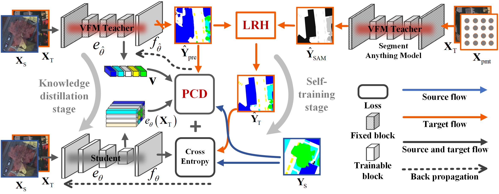

<h2 align="center">Learning from Vision Foundation Models for Cross-domain Remote Sensing Image Segmentation</h2>

<h5 align="center">by <a href="https://scholar.google.com/citations?user=LXlWdyQAAAAJ&hl=zh-CN">Wang Liu</a>, 
Puhong Duan, Zhuojun Xie, Xudong Kang, and Shutao Li</h5>


---------------------

<h5 align="left">This is the official implementation for 
<a href="https://scholar.google.com/citations?user=LXlWdyQAAAAJ&hl=zh-CN">LFMDA</a>. 

<div align=center></div>
<p align="center">Fig. 1 An overview of the proposed LFMDA.</p>

---------------------
## Getting Started

### Environment:
- conda create -n lfmda python=3.8
- source activate lfmda
- pip install torch==1.13.1+cu117 torchvision==0.14.1+cu117 -f https://download.pytorch.org/whl/torch_stable.html
- pip install torch-scatter -f https://data.pyg.org/whl/torch-1.13.1+cu117.html
- pip install -r requirement.txt
- pip install -e .
- cd CLIP && pip install -e . && cd ..
### Prepare datasets

#### 1. Generate from raw:

- Download the raw datasets from <a href="https://www.isprs.org/education/benchmarks/UrbanSemLab/2d-sem-label-potsdam.aspx">here</a>.
- Run the preprocess script in ./convert_datasets/ to crop train, val, test sets:\
`python convert_datasets/convert_potsdam.py`\
`python convert_datasets/convert_vaihingen.py`
- Generate local regions by run \
`python tools/generate_local_regions.py`
#### 2. Alternately, you can also download the processed data
- Download the processed datasets from <a href="https://pan.baidu.com/s/1rWHSgRpSVPlLt5_bykHCOg?pwd=6th5">here</a>.
- reorganize the directory tree.
#### 3. The prepared data is formatted as follows:
"\
./data\
----&nbsp;IsprsDA\
&nbsp;&nbsp;&nbsp;&nbsp;&nbsp;----&nbsp;Potsdam\
&nbsp;&nbsp;&nbsp;&nbsp;&nbsp;&nbsp;&nbsp;&nbsp;&nbsp;&nbsp;----&nbsp;ann_dir\
&nbsp;&nbsp;&nbsp;&nbsp;&nbsp;&nbsp;&nbsp;&nbsp;&nbsp;&nbsp;----&nbsp;img_dir\
&nbsp;&nbsp;&nbsp;&nbsp;&nbsp;&nbsp;&nbsp;&nbsp;&nbsp;&nbsp;----&nbsp;reg_dir\
&nbsp;&nbsp;&nbsp;&nbsp;&nbsp;----&nbsp;Vaihingen\
&nbsp;&nbsp;&nbsp;&nbsp;&nbsp;&nbsp;&nbsp;&nbsp;&nbsp;&nbsp;----&nbsp;ann_dir\
&nbsp;&nbsp;&nbsp;&nbsp;&nbsp;&nbsp;&nbsp;&nbsp;&nbsp;&nbsp;----&nbsp;img_dir\
&nbsp;&nbsp;&nbsp;&nbsp;&nbsp;&nbsp;&nbsp;&nbsp;&nbsp;&nbsp;----&nbsp;reg_dir\
"

---------------------

### Evaluate the trained RegDA models.\
Download the pre-trained [<b>weights</b>](https://pan.baidu.com/s/1iSPb67jnnbaoqjOj23y3Qw?pwd=7muu) and logs.
#### 1. on Vaihingen (IRRG) -> Potsdam (IRRG) task
Run evaluating: `python tools/eval.py --config-path st.lfmda.2potsdam_segformer --ckpt-path log/lfmda/SegFormer_MiT-B2/2potsdam/ssl_proto_sam_0.95/Potsdam_stu_best.pth --test 1`
#### 2. on Potsdam (IRRG) -> Vaihingen (IRRG) task
Run evaluating: `python tools/eval.py --config-path st.lfmda.2vaihingen_segformer --ckpt-path log/lfmda/SegFormer_MiT-B2/2vaihingen/ssl_proto_sam_0.95/Vaihingen_stu_est.pth --test 1`

---------------------

### Train the LFMDA (SegFormer_MiT-b2)
Download [imagenet-pretrained](https://github.com/NVlabs/SegFormer) mit-b2.pth to ./ckpts/backbones/mit/mit_b2.pth
```bash 
bash runs/lfmda/2vaihingen_segformer.sh
```
```bash 
bash runs/lfmda/2potsdam_segformer.sh
```

---------------------

### Inference single file
```bash 
python tools/infer_single.py st.lfmda.2potsdam_segformer log/lfmda/SegFormer_MiT-B2/2potsdam/ssl_proto_sam_0.95/Potsdam_stu_best.pth [image-path] --save-dir [save-dir-path]
```

---------------------

### Cite
```bash 
@ARTICLE{LFMDA,
  author={Liu, Wang and Duan, Puhong and Xie, Zhuojun and Kang, Xudong and Li, Shutao},
  journal={IEEE Transactions on Image Processing}, 
  title={Learning from Vision Foundation Models for Cross-domain Remote Sensing Image Segmentation}, 
  year={2025},
  doi={10.1109/TIP.2025.3588041},
}

```
